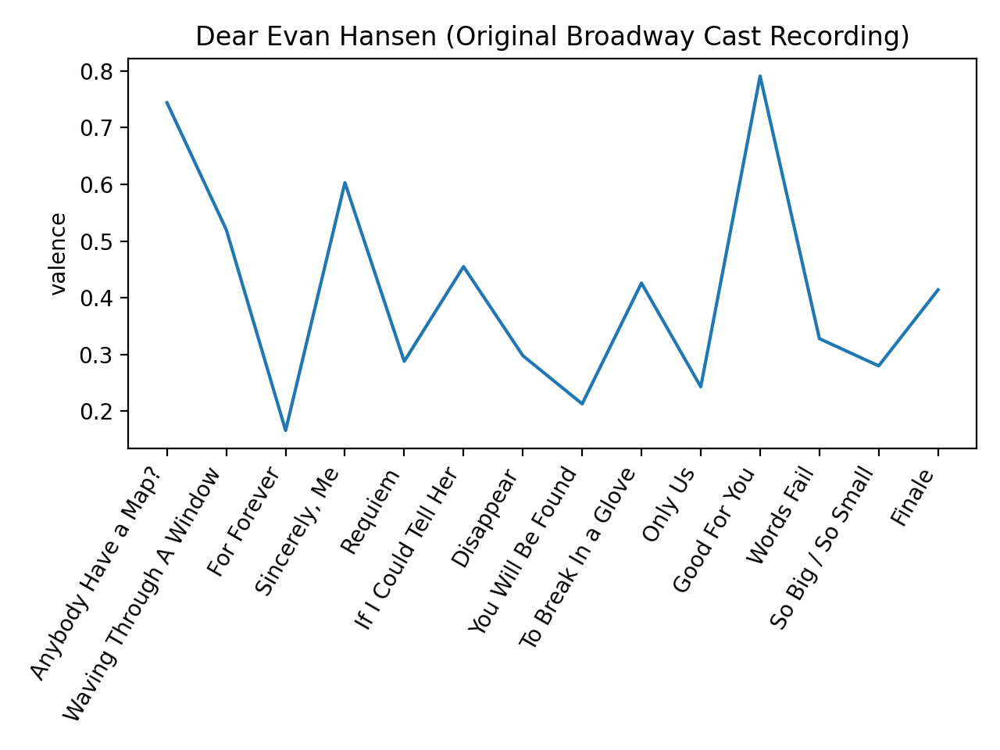
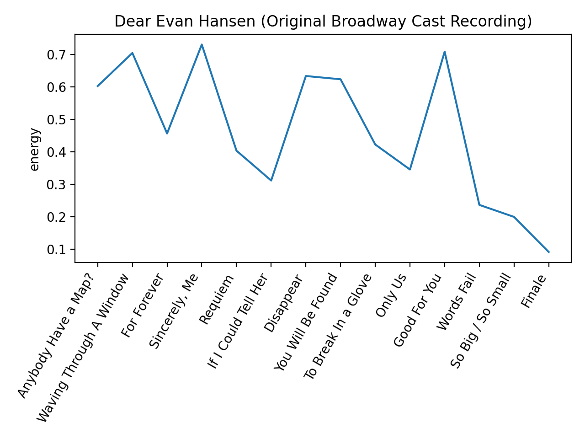
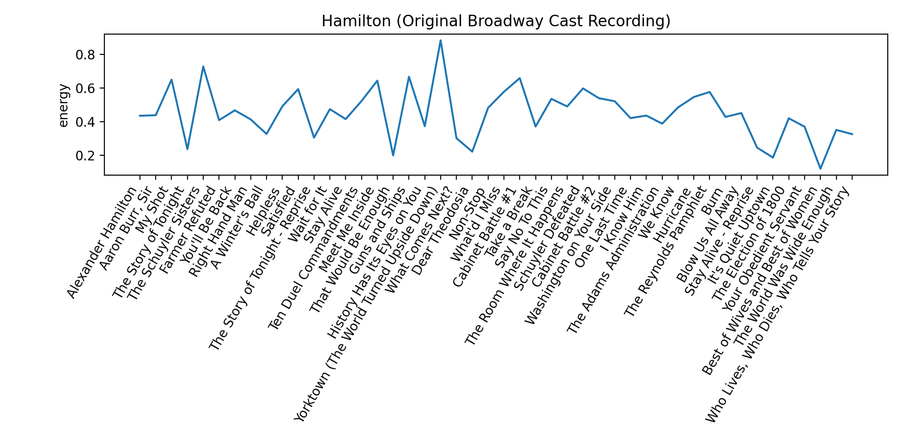
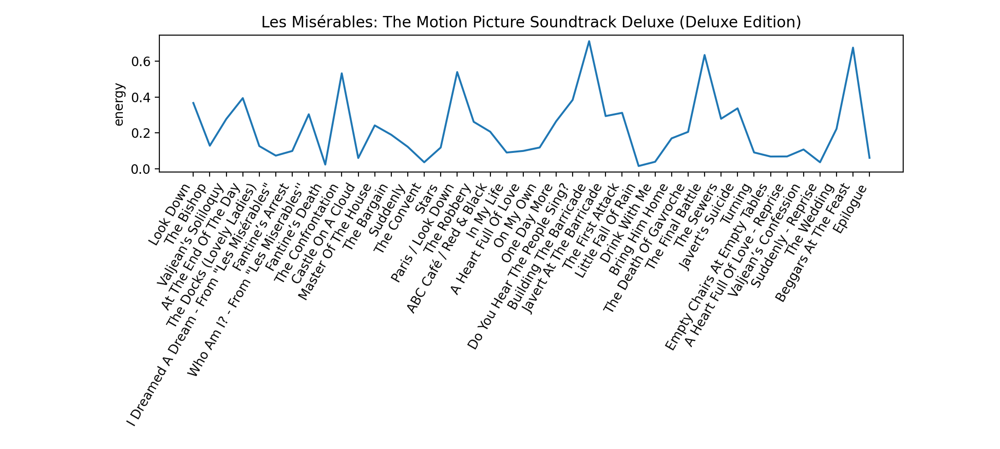
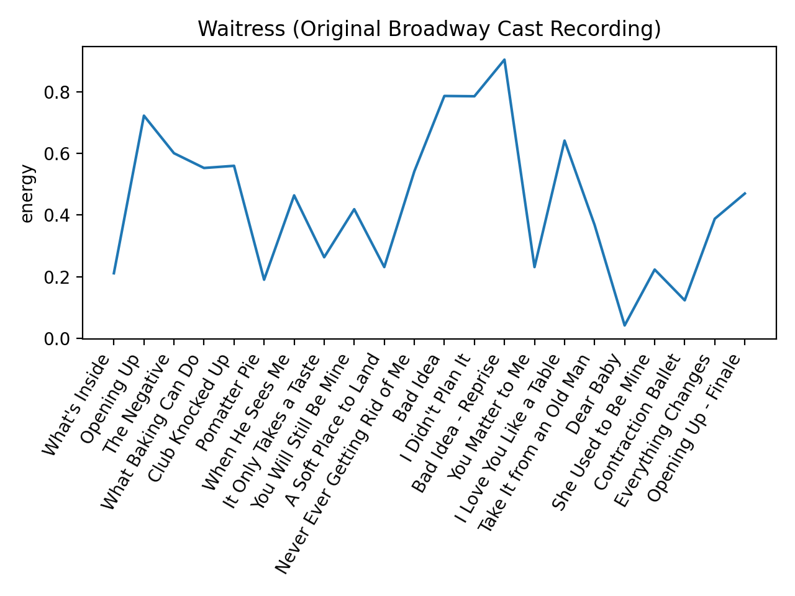
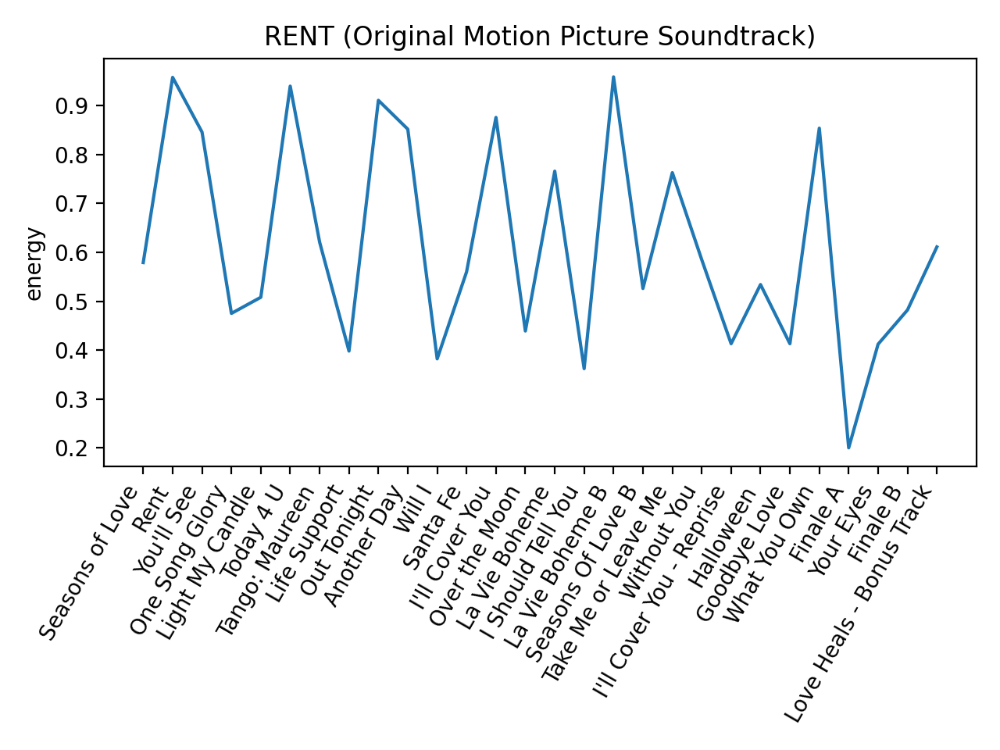

# Musical Theater Album Analysis using Spotify API
Looking for insights into pacing, narrative structure, and other patterns in musical theater albums using audio features in the Spotify API

## Inspiration
One of the features included in the [Spotify API](https://developer.spotify.com/discover/) that I found particularly interesting is Audio Features & Analysis, which provides audio features - calculated values like acousticness, instrumentalness, energy, and many others for each song - as well as more low-level audio analysis of song structure, rhythm, pitch, and timbre.

As a musical theater nerd, I thought it would be interesting to plot some of these values over the course of a musical theater album and see if there are any patterns, for example if we would be able to see rising action / falling action. There are obvious limitations to this - there's often a lot of narrative action between songs, as well as action within a song that can change the mood drastically, but my intuition is that since songs are kind of the driving force for narrative in musicals, we can gain some insight just by looking at the songs. 

Currently the only functionality is plotting these values for an album but I'm hoping to eventually use the audio analysis information as well to do some more detailed analysis and visualization of these musicals. 

## Deployment
This project uses [Spotipy](https://github.com/plamere/spotipy) and [matplotlib](https://matplotlib.org/). All required packages are in `requirements.txt`.

To use Spotipy, you will need to create an app at [https://developer.spotify.com/](https://developer.spotify.com/) and then place your client ID and client secret in environment variables:
```
export SPOTIPY_CLIENT_ID=client_id
export SPOTIPY_CLIENT_SECRET=client_secret
```

If you want to plot these values for your favorite albums, I created an extremely basic [interface.py](interface.py) where you can search for an album and choose a value to plot. 

## Results
(All of these plots, as well as some others, are located in [plots/](plots)). 

I plotted audio feature values for some of my favorite musical soundtracks and did some very geeky narrative analysis:

### Dear Evan Hansen
I started by plotting valence ("musical positiveness"):
<p align="center"></p>
The main thing I notice is that I disagree with a lot of the valence values (For Forever is a pretty happy song outside the context of the show, Sincerely, Me should probably be much higher, and Good For You is definitely not very positive). The Spotify API doesn't go into detail about how it calculates these values; presumably it's some sort of data-driven, proprietary algorithm, but this shows the limitations of using a single calculated value to encapsulate the mood of a song. 

I then tried plotting energy:
<p align="center"></p>
I think the energy values capture the pacing of the show pretty well - the first act ebbs and flows, the climax happens around Good For You / Words Fail, and the pace slows down a lot after that with the emotional intensity of Words Fail and So Big / So Small. 

Since energy worked better here, I'll mostly stick with plotting energy in this analysis, although I also included the valence plots in the folder. 

### Hamilton
First thing to note is that since Hamilton is sung-through, and the album contains almost every song, there's a lot less gap in between songs, so we expect that plotting song values here will be a better reflection of the overall narrative of the musical. 


Having not actually seen the musical, I can't really evaluate how accurate this is, but we can vaguely see the rising tension in the beginning and the emotional winding-down / falling action at the end. The graph suggests that the climaxes would be around Yorktown, the Cabinet Battles, and the Reynolds Pamphlet, which is pretty close to what I would guess from just listening to the soundtrack. 

### Les Misérables

Les Mis is also sung-through (I believe), and look how nice this graph is!! You can really see the oscillation of narrative pace that is common in all forms of storytelling, and you can even see how the plot kind of gradually ramps up to a peak and down after. Most of the peaks correspond to adrenaline-filled scenes on the front lines of the revolution (ABC Cafe, the barricades, the sewers) and in between we have the love ballads and soliloquys (Suddenly, A Heart Full of Love, Empty Chairs at Empty Tables). 

### Waitress
<p align="center"></p>
Yet another musical I have not seen (but would love to!!). From my hours and hours of listening to the cast album, I think I can say that the show starts and ends pretty positively, which is reflected in the graph. 

An interesting thing I noticed is that in between the series of fairly calm Jenna songs (It Only Takes a Taste -> A Soft Place to Land) and the frenetic, high-energy Bad Idea, we switch over to a different character's more medium-energy song (Never Ever Getting Rid of Me) as sort of a transition. Like Les Mis, Waitress seems to interleave different characters' songs in a way that allows the oscillations in pace to be more gradual. 

I'm interested in doing some lower-level analysis for Waitress in particular because the score in general is very musically interesting - for example What Baking Can do features lots of key changes / modulation (including a few DOWNWARDS key changes which are pretty uncommon as far as I know), and When He Sees Me uses very unconventional meters at times, staying on a chord for a bar or two longer than expected. 

### Rent
<p align="center"></p>
I haven't seen Rent and I'm not super familiar with it, so again I am not in a position to evaluate, but I thought this graph was pretty interesting and funny. It's an absolute rollercoaster, which is basically what my impression of the musical is. 
